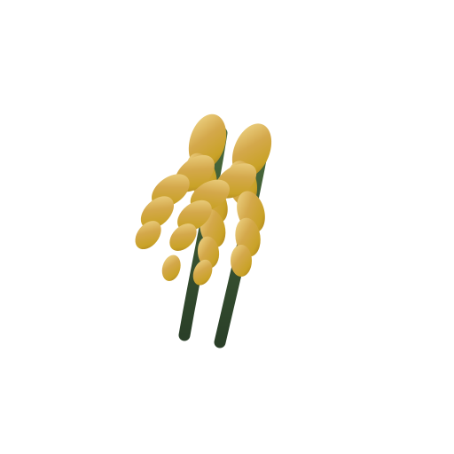

# Regionaler Geschmack

Lokalna aplikacja / PWA do odkrywania regionalnych producentów i smaków.



**Logo marki:** wyłącznie dwa złote kłosy pochylone w prawo (`assets/icons/logo-master.svg`).

## Marka — Brand Book

**Oficjalny Brand Book (przed publikacją):**  
[`docs/brand/BRAND-BOOK.md`](docs/brand/BRAND-BOOK.md) · wizualnie: [`docs/brand/brand-book.html`](docs/brand/brand-book.html)

- **Ikona aplikacji:** dwa złote kłosy pochylone w prawo (`assets/icons/logo-master.svg`) — PWA / store / favicon
- Nazwa „Regionaler Geschmack” = wordmark obok ikony (nie w pliku ikony)
- Warianty ikony: `assets/brand/logo-on-light.svg` · `logo-on-dark.svg` · `logo-mark.svg`
- Paleta: zieleń · złoto · pszenica · miód · krem
- Ikony / favicon / PWA / store: `npm run generate-icons`
- Strażnik: `npm run living-brand`
- Raport 20A: [`docs/brand/ETAP-20A-BRAND-REPORT.md`](docs/brand/ETAP-20A-BRAND-REPORT.md)

## Start

```bash
npm start
```

## Narzędzia developerskie

```bash
npm run health
npm run daily-report
npm run weekly-premium
npm run guardian
```
